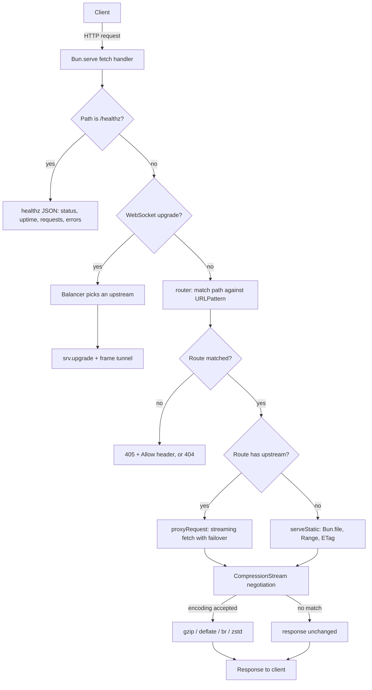
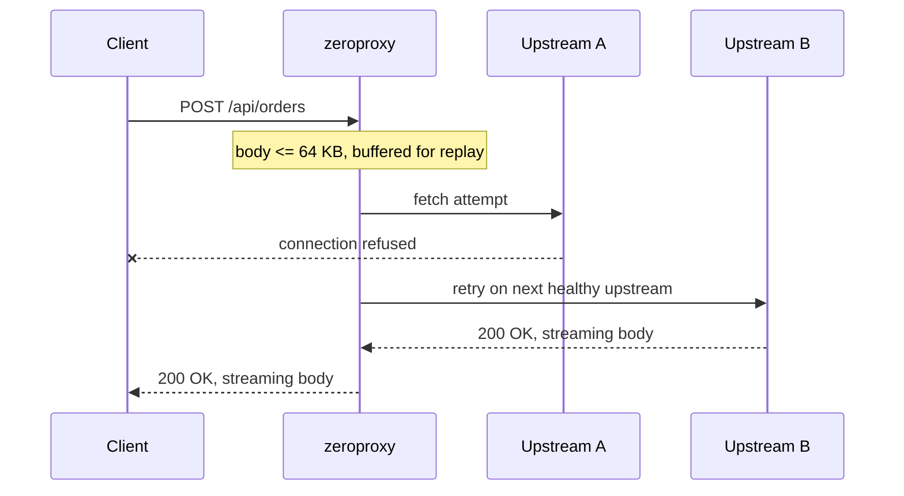
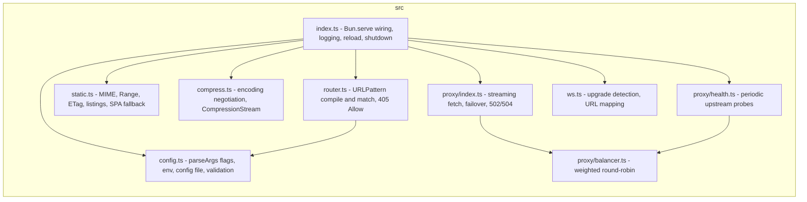

# zeroproxy

A zero-dependency **reverse proxy, HTTP router, and static file server** built on Bun's
runtime built-ins - `"dependencies": {}`. No npm installs, no packages, nothing to audit.

**Track:** C - Web & Network
**Runtime:** Bun 1.4+
**Dependencies:** zero

---

## What it does

One Bun-native binary that does the four things a real backend needs, none of which reach
for a package:

1. **Reverse proxy** - forwards requests to one or more upstream targets, streaming large
   bodies without buffering the whole payload, with weighted round-robin load balancing and
   automatic failover across multiple upstreams.
2. **WebSocket proxy** - tunnels WebSocket connections to an upstream using the global
   `WebSocket` client and `Bun.serve`'s native upgrade, with no `ws` package.
3. **Static file server** - serves a directory with correct MIME types, `Range` requests
   for partial content, `ETag`/`If-None-Match` caching, directory listings, and SPA
   fallback.
4. **HTTP router** - matches incoming requests to handlers using native `URLPattern`, with
   method, wildcard, and named-parameter support.

It is the kind of tool most people build with `express` + `http-proxy-middleware` +
`serve-static`. This one imports none of them.

## How it works

`zeroproxy` is one process, one event loop, and no threads of its own. Every request
enters through `Bun.serve`'s `fetch` handler, is classified, routed, and answered, and
the connection is handed back to the runtime.



In plain English, each request:

1. Reaches the `fetch` handler in `src/index.ts`.
2. `/healthz` short-circuits with uptime and counters; no routing involved.
3. A WebSocket upgrade, when the matched route has `"ws": true`, is handed to
   `srv.upgrade` and tunneled to a balancer-picked upstream (`src/ws.ts`).
4. Otherwise `src/router.ts` runs the path against every configured `URLPattern` in
   order and returns the first match.
5. A matching path with the wrong method yields `405` plus an `Allow` header; no
   match yields `404`.
6. An upstream route goes to `proxyRequest` (`src/proxy/index.ts`), which streams
   the response via `fetch` and fails over to the next healthy upstream when the
   first attempt fails.
7. A static route goes to `serveStatic` (`src/static.ts`), which streams `Bun.file`
   with MIME, `Range`, `ETag`/`If-None-Match` and directory listing.
8. The response passes through compression (`src/compress.ts`): when the client
   accepts an encoding and the body benefits, it is piped through a native
   `CompressionStream` and `Vary: Accept-Encoding` is set.

That is the full path for one request. `fs.watch` can swap the compiled routes in
place when the config file changes, and `SIGINT`/`SIGTERM` drain in-flight requests
before `server.stop()`.

### How a request fails over

When an upstream is down, the request is retried on the next healthy target. A body
at or below `retryBodyLimitBytes` (or no body at all) is buffered so it can be
replayed; a larger body is sent once, because a consumed stream cannot be sent twice.
Unknown-length (chunked) bodies are read up to the replay limit and replayed if they
end within it; beyond it, the already-read bytes are spliced onto the unread tail and
the body is sent once, so memory stays bounded. A timed-out attempt is retried only
when the method is idempotent (GET/HEAD/PUT/DELETE/OPTIONS/TRACE): a timeout does not
prove the request was not delivered, and replaying a POST that was already applied
would duplicate it. Connection failures, where nothing was delivered, are retried for
every method.



`src/proxy/health.ts` probes dead upstreams on a timer and removes them from rotation
until they recover, so a request never spends a retry on a target the balancer already
knows is down.

## Project structure

In `src/`, `index.ts` is the only file that touches `Bun.serve`. Everything else is a pure
function or factory over its inputs, which is what keeps each module testable in
isolation. (The demo's mock upstream, `demo/upstream.ts`, is the one deliberate
`Bun.serve` user outside `src/` - it exists to give the proxy something to forward to.)



Tests (`tests/`) exercise each module directly, from `URLPattern` edge cases and 405
`Allow` headers to weighted failover, static `Range`/`ETag`, and compression
negotiation. `bench/bench.ts` is a zero-dependency load test. `demo/` is the live
demo package: two mock upstreams, a zero-dependency dashboard page, and a
one-command runner.

## Quick start

One command builds (choose either):

```bash
make build                 # needs make
bun run build              # needs only Bun
```

Then run with a config file, or directly without compiling:

```bash
./zeroproxy --config zeroproxy.config.json
bun run src/index.ts --port 8080 --upstream http://localhost:3000
```

Every task is available through both `make <task>` and `bun run <task>` (the `Makefile`
wraps the same `package.json` scripts - either one is a single command):

| Task | Effect |
|---|---|
| `build` | Compile `src/` into the `zeroproxy` binary |
| `demo` | Start the full local demo (proxy + both mock upstreams) |
| `test` | Run the test suite (`bun test`) |
| `typecheck` | Type-check with `tsc --noEmit` |
| `proof` | Write `deps-proof.txt` (`bun pm ls` output) |
| `bench` | Run the built-in load test (`bench/bench.ts`) |
| `reproduce` | Build twice and write `BUILD_HASHES.txt` (byte-identical check) |
| `clean` | Remove binaries and generated proof/hash files |

Note on `reproduce`: Bun embeds the output filename into the compiled binary, so
byte-identical builds require a constant `--outfile` name. The target builds twice to one
name and copies the results apart. Reproducibility holds on the same machine and toolchain,
as the bonus requires; two builds on different environments may differ.

One command, one runnable artifact - no install step.

## Live demo

`demo/` is the click-and-play package: two mock upstreams, a config that puts
zeroproxy in front of them, and a dashboard page served by zeroproxy itself.
Clone and run it with one command (needs only Bun):

```bash
git clone https://github.com/f-ei8ht/zeroproxy.git
cd zeroproxy
make demo                # or: bun run demo
```

It starts upstream A on :9101, upstream B on :9102, and zeroproxy on :8080,
waits until the proxy answers, and prints the URL. Open
`http://localhost:8080`. The dashboard polls the built-in `/healthz` endpoint
live and has one button per feature: send a request through the proxy (the
response names which upstream answered, so the round-robin is visible), fetch
the first 100 bytes of a file with a `Range` header (206 + `Content-Range`),
and open a WebSocket through the tunnel (echoed by the upstream). The page is
plain HTML, CSS, and JavaScript - no framework, no build step. Ctrl-C stops
all three processes.

## Configuration

```json
{
  "port": 8080,
  "compression": true,
  "retryBodyLimitBytes": 65536,
  "healthCheck": { "intervalMs": 5000, "timeoutMs": 2000, "path": "/" },
  "routes": [
    {
      "pattern": "/api/*",
      "upstream": [
        { "url": "http://10.0.0.1:3000", "weight": 3 },
        "http://10.0.0.2:3000"
      ]
    },
    { "pattern": "/ws/*", "upstream": "http://10.0.0.1:3000", "ws": true },
    { "pattern": "/users/:id", "upstream": "http://localhost:3000" },
    { "pattern": "/static/*", "static": "./public", "fallback": "index.html", "cacheControl": "public, max-age=3600" }
  ]
}
```

Route keys:

- `pattern` - `URLPattern` route string (wildcards `/*`, named params `/:id`).
- `upstream` - one URL, or an array mixing strings and `{ url, weight }` objects; requests
  are round-robined proportionally to weight and fail over to the next healthy upstream.
- `static` - a directory (or single file) to serve.
- `index` - the directory index file name (default `index.html`).
- `fallback` - a file (relative to the `static` root) served for unmatched paths inside a `static` route (SPA mode).
- `cacheControl` - `Cache-Control` value applied to `static` responses.
- `ws` - set `true` on an `upstream` route to proxy WebSocket connections.
- `method` - restrict the route to one HTTP method.

Top-level keys:

- `port`, `host` - bind address.
- `compression` - toggle `Accept-Encoding` negotiation (default true).
- `retryBodyLimitBytes` - bodies up to this size (default 64 KB) are buffered so failover can
  replay them; larger/streaming bodies are sent once. Unknown-length (chunked) bodies are
  read up to this limit and streamed beyond it, never buffered whole.
- `upstreamTimeoutMs` - per-attempt upstream timeout (default 30000); a timeout surfaces as 504.
- `shutdownTimeoutMs` - cap on graceful drain before exit (default 10000).
- `minCompressBytes` - responses smaller than this (default 256) skip compression.
- `maxRequestBodyBytes` - larger request bodies are rejected with 413 (default 0, unlimited).
- `healthCheck` - `{ intervalMs, timeoutMs, path }`; dead upstreams are probed periodically
  and removed from rotation until they recover.
- `tls` - `{ cert, key }` paths to serve HTTPS.

CLI flags (`--port`, `--host`, `--upstream`, `--config`, `--root`) override or extend the
file; `ZEROPROXY_PORT` / `ZEROPROXY_HOST` env vars are fallbacks. `--upstream` adds a
catch-all proxy route on top of any file routes.

A `GET /healthz` endpoint is served on every run, reporting `status`, `uptime`, and
cumulative `requests`/`errors` counters. When a config file is used, it is watched and
routes reload live on change (port and host are fixed for the process lifetime).

## Features

- **Routing** - `URLPattern`-based matching: wildcards (`/api/*`) and named params (`/users/:id`);
  returns `405 Method Not Allowed` with an `Allow` header when the path matches but the method
  does not.
- **Reverse proxying** - streams request and response bodies via `fetch()` without buffering
  the whole payload in memory; weighted round-robin across multiple upstreams; hop-by-hop
  headers stripped and `Via` appended per RFC 9110; oversized bodies rejected with 413.
- **Health checks** - dead upstreams are probed every `intervalMs` and removed from rotation
  until they recover.
- **Failover with body replay** - a request body up to `retryBodyLimitBytes` (declared or
  unknown-length) is buffered so a failed attempt is retried on the next upstream; a timed-out
  attempt is retried only for idempotent methods, so a delivered request is never applied
  twice.
- **WebSocket proxying** - native `Bun.serve` upgrade tunnels to an upstream picked by the
  balancer, via the global `WebSocket` client; frames pipe both ways with no `ws` package.
- **Static serving** - correct `Content-Type` by extension, `ETag`/`Last-Modified` caching,
  `Range`-header partial content (206), `Cache-Control`, directory listings with `../`,
  dotfiles blocked, and SPA `fallback`.
- **Compression** - negotiates `Accept-Encoding` with q-values (an encoding excluded with
  `q=0` is never chosen) and gzip/deflate/brotli/zstd-compresses
  text responses (skips already-compressed image/video/audio/font and tiny payloads) using
  native `CompressionStream`, with `Vary: Accept-Encoding` set for cache correctness.
- **TLS** - serve HTTPS via the `tls` config (cert/key paths).
- **Health + metrics** - a `GET /healthz` endpoint reports uptime and request/error counts.
- **Live config reload** - watches the config file and swaps routes in place without
  dropping connections.
- **Concurrency** - Bun's event loop handles concurrent connections natively; no thread pool
  or worker-management code is written by this project.
- **Graceful shutdown** - drains in-flight requests on `SIGINT`/`SIGTERM` before exiting.

## Concurrency model (honest disclosure)

`zeroproxy` relies entirely on Bun's single-threaded, non-blocking event loop - the same
model Node/Bun use for every I/O operation. There is no manual thread pool, no
`worker_threads`, no custom scheduler written here. The "concurrency" is the runtime doing
what it always does. Under sustained load with slow upstreams a single process is bound by
that one event loop; horizontal scaling (multiple processes behind an OS-level load
balancer) is the intended path beyond that and is out of scope for this submission.

## Limits (honest gaps)

- No HTTP/2 or HTTP/3 - Bun's built-in server is HTTP/1.1.
- No certificate issuance - TLS is supported via the `tls` config, but you bring the cert.
- Body failover is bounded - a body larger than `retryBodyLimitBytes` is sent once and not
  replayed, because a consumed stream cannot be sent twice - the same trade-off real proxies
  make. A timed-out attempt is never retried for non-idempotent methods.
- Single ranges only - a multi-range `Range` header is ignored and the full body is sent
  (RFC 9110 allows ignoring unsupported range forms) instead of 206 multipart/byteranges.
- `X-Forwarded-For` is not set - Bun's `fetch` handler does not expose the client address; a
  value set by a front proxy is forwarded untouched.
- A live WebSocket is not reconnected if its upstream dies mid-connection; only the initial
  target is load-balanced.
- Not compared against nginx/Caddy for raw throughput; see the benchmark below for honest
  numbers from this machine.

## Benchmark

`bun run bench` (or `make bench`) runs a built-in load test: it serves `public/index.html`
and fires 20,000 requests across 32 concurrent workers. No `autocannon`, just `fetch` +
`performance.now`. Honest numbers from the author's machine (ThinkPad E16 Gen 2, AMD
Ryzen 5 7535U, 12 threads, Manjaro Linux, Bun 1.4):

| Metric | Value |
|---|---|
| Throughput | ~4,900 req/s |
| p50 latency | ~6 ms |
| p90 latency | ~8 ms |
| p99 latency | ~13 ms |

These are single-process, single-core results on one laptop; scaling is horizontal (multiple
processes behind a load balancer). Static serving uses async fs calls throughout, so the
event loop never blocks on disk - at a modest throughput cost versus synchronous stat.

## Zero-dependency compliance

- `package.json` has empty `"dependencies": {}` (dev-only tooling in `devDependencies` never ships
  in the compiled artifact).
- `bun pm ls` output in `deps-proof.txt` shows zero third-party runtime dependencies.
- Every "I'd normally import X" decision is documented in [`STDLIB.md`](./STDLIB.md).

### Key substitutions (full list in STDLIB.md)

| Would normally install | Used instead |
|---|---|
| `path-to-regexp` | `URLPattern` |
| `http-proxy-middleware` | `fetch()` + `Bun.serve()` streaming |
| `http-proxy` WebSocket support / `ws` | `Bun.serve()` upgrade + global `WebSocket` |
| `serve-static` / `send` | `Bun.file()` + manual `Range`/`ETag` handling |
| `compression` (gzip middleware) | native `CompressionStream` |
| `mime-types` | a small hand-written extension-to-MIME table |
| `chalk` (CLI log output) | `util.styleText()` |
| `minimist` (arg parsing) | `util.parseArgs()` |
| `autocannon` (load testing) | a stdlib `fetch` bench script |

## Testing

```bash
bun test
```

Covers route matching (wildcard/param edge cases and 405 `Allow`), proxy streaming, hop-by-hop
stripping and `Via`, weighted and health-aware failover (small-body replay, unknown-length
bodies, the idempotent timeout rule, 413 caps), WebSocket request detection, URL mapping, and
a live tunnel, static MIME / `Range` (single, suffix, multi-range, malformed) / `ETag` /
`Last-Modified` / dotfile / `Cache-Control` behavior, directory listings and SPA fallback,
config validation, upstream health checks, and compression negotiation with q-values. An
integration suite boots the real server and exercises `/healthz`, proxying, 405, static
serving, the WebSocket tunnel, live config reload, and `SIGTERM` shutdown. Tests use
`bun:test`, a built-in - no test framework dependency. A demo suite boots the whole
demo package end to end: the dashboard at `/`, the 206 `Range` slice, round-robin
between the mock upstreams, and the WebSocket echo through the tunnel.

## References

Built against the runtime docs and open specifications. All code was written fresh
during the event window; no third-party source was vendored.

- **Bun** - [`Bun.serve`](https://bun.sh/docs/api/http), [`Bun.file`](https://bun.sh/docs/api/file-io), [`URLPattern`](https://bun.sh/docs/api/url), [build / compile](https://bun.sh/docs/bundler/full-bundler)
- **TypeScript** - [typescriptlang.org](https://www.typescriptlang.org/), strict-mode best practices
- **TypeScript best practices** - [andredesousa/typescript-best-practices](https://github.com/andredesousa/typescript-best-practices)
- **Hackathon cheat-sheets** - [zerodepshack.com/cheatsheets](https://zerodepshack.com/cheatsheets), the per-track stdlib capability matrix that drove the substitution choices in `STDLIB.md`

## License

[MIT](./LICENSE)
